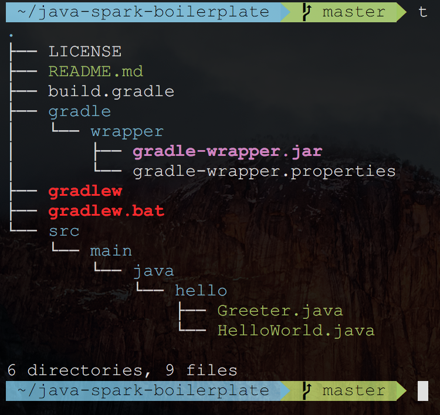

# java-spark-boilerplate
a boilerplate to get a spark server up and running in a jiffy

## Run it locally
- `git clone`
- `cd java-spark-boilerplate`
- `./gradlew build`
- `./gradlew run`
- Hit `http://localhost:4567/hello` in the browser

## The project structure

- `build.gradle`- The main build system configuration file
- `gradlew`- The generated convenience script; invoke this if gradle is not installed globally on your machine
- `src/main/java/hell/HelloWorld.java`- The main class and method that spawns up the server
- Everything else is boilerplate stuff that shouldn't need touched (or if it does, I don't know why. Have't needed to yet)
